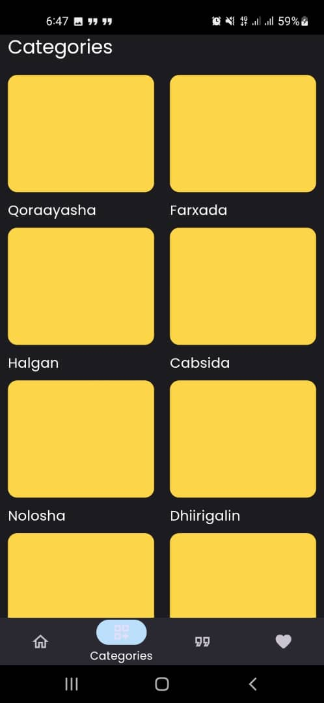
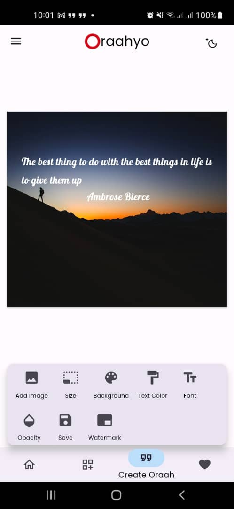

# Oraahyo Mobile App - Your Trusted Source for Somali Proverbs, Wisdom, and Quotes

Oraahyo is a Flutter-based mobile app designed to immerse you in the rich tapestry of Somali sayings, wisdom and quotes. It provides a vibrant platform to:

## Features 
- Discover thousands of insightful sayings, categorized by theme for easy browsing.
- Ability to create download and add favorites to your desired quotes/wisdom
- Daily quotes that will inspire and make your day

## Customization & Contribution

Oraahyo is designed to be adaptable and welcomes your contributions!

- Add your own quotes: Contribute to the repository with new proverbs, wisdom, or quotes to enrich the collection.
- Request new features: Share your ideas for enhancements or functionality you'd like to see.
- Join the community: Connect with other users and enthusiasts to discuss Somali language, culture, and the significance of these expressions.

